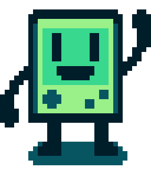

# Retrogochi
A simple retro-like tamagochi made in Python with pygame.

Welcome to **Retrogochi**, an small coding videogame developed in Python with pygame. You will need to take care of your Retrogochi. But... how?

The answer is **coding**.

Your Retrogochi will be synchronized with your **GitHub profile**, and the number of daily **commits** will be yout Retrogochi's food.

### Meet Gochi!

This will be your new coding partner. It will ask you for specific programs to add to its collection. Will you be able to collect them all?